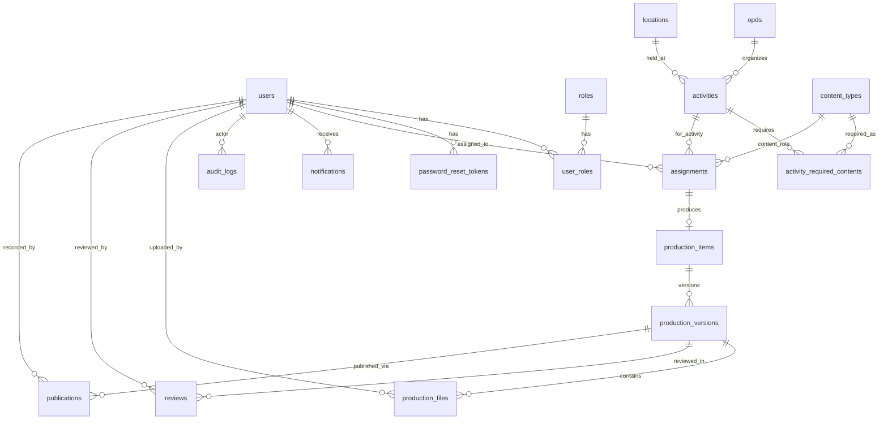

# 🔍 Audit Menyeluruh Program SIMIKP (Folder Merge)

Hasil analisis seluruh file kode pada frontend, backend, database schema, serta konektivitas antar lapisan.

---

## A. Status Koneksi Frontend ↔ Backend ↔ Database

### ✅ Sudah Terhubung Dengan Benar

| Fitur / Halaman | Frontend | Backend | DB Table |
|---|---|---|---|
| **Login & Session** | `AuthContext.tsx` → `POST /auth/login`, `GET /auth/me` | `auth.routes.ts` | `users`, `roles`, `user_roles` |
| **Dashboard (Admin & Ahli Pertama)** | `DashboardPage.tsx` → `/activities`, `/assignments`, `/dashboard/stats` | `dashboard.controller.ts`, `activities.controller.ts`, `assignments.controller.ts` | `activities`, `assignments`, `opds`, `users` |
| **Kegiatan (CRUD)** | `KegiatanPage.tsx` → `/activities` | `activities.controller.ts` | `activities`, `locations`, `opds`, `activity_required_contents`, `content_types` |
| **Penugasan Khusus (Admin)** | `PenugasanPage.tsx` → `/assignments` | `assignments.controller.ts` (`getAllAssignments`) | `assignments` JOIN `activities`, `content_types`, `users` |
| **Agenda Tersedia (Petugas)** | `PetugasAgendaTersediaPage.tsx` → `/activities`, `/assignments` | `activities.controller.ts`, `assignments.controller.ts` | `activities`, `activity_required_contents`, `assignments` |
| **Penugasan Saya (Petugas)** | `PetugasPenugasanPage.tsx` → via `petugas-store.ts` → `/assignments` | `assignments.controller.ts` (`updateAssignment`) | `assignments` |
| **Review & Persetujuan (Ahli Pertama)** | `ReviewPage.tsx` → via `petugas-store.ts` | `assignments.controller.ts` | `assignments` (kolom `revision_notes`, `revision_author`, `revision_date`) |
| **Laporan Produksi (Excel & PDF)** | `LaporanPage.tsx` → `/reports/production`, `/reports/production/excel`, `/reports/production/pdf` | `reports.service.ts` | `activities`, `assignments`, `content_types`, `users` |
| **Upload Berkas (Foto/Video)** | `PetugasPenugasanPage.tsx` → `/storage/upload` | `storage.routes.ts` | Disimpan ke **HDD lokal** (`backend/storage/uploads/`) |
| **Daftar Anggota** | `DaftarAnggotaPage.tsx` → `/users/petugas` | `users.controller.ts` | `users`, `user_roles`, `roles` |
| **Tambah Petugas** | `TambahPetugasPage.tsx` → `/users/petugas` (POST multipart) | `users.controller.ts` (createPetugas) | `users`, `user_roles` |
| **Profil** | `ProfilPage.tsx` → `/users/profile` | `users.controller.ts` (updateProfile) | `users` |
| **Notifikasi** | `AppLayout` / `PetugasLayout` → `/system/notifications` | `system.controller.ts` / `notifications.service.ts` | `notifications` |
| **Audit Log** | Backend internal | `audit.service.ts` | `audit_logs` |
| **Bank Konten** | `BankKontenPage.tsx` → `/productions/bank-konten` | `productions.controller.ts` (getBankKonten) | `production_files`, `production_versions`, `production_items`, `assignments` |
| **Produksi (Admin)** | `ProduksiPage.tsx` → `/productions` | `productions.controller.ts` (getAll) | `assignments` JOIN `production_items`, `production_versions` |
| **Publikasi** | `PublikasiPage.tsx` → `/publications` | `publications.routes.ts` | `publications`, `production_versions` |
| **Review (DB Level)** | `ReviewPage.tsx` (backend) → `/reviews` | `reviews.routes.ts` | `reviews`, `production_versions` |
| **Forgot/Reset Password** | `ResetPasswordPage.tsx` → `/auth/forgot-password`, `/auth/reset-password` | `auth.routes.ts` | `password_reset_tokens`, `users` |
| **Email Notifikasi** | Backend internal | `mail.service.ts` | Tidak ada tabel (langsung kirim via Nodemailer) |

---

## B. 🐛 Masalah & Ketidaktepatan yang Ditemukan

### 1. ❌ `mock-api.ts` — FILE TIDAK TERPAKAI (DEAD CODE)

> [!WARNING]
> File [mock-api.ts](file:///C:/Users/ramad/Documents/File%20Kuliah/File%20Magang/SIMIKP/Merge/frontend/src/lib/mock-api.ts) masih ada dan mengimpor `mockKegiatan`, `mockPenugasan`, `mockProduksi`, `mockReview`, `mockPublikasi`, `mockBankKontenFolders` dari `mock-data.ts`.

- **Tidak ada file lain yang mengimpornya.** Ini adalah _dead code_ yang tidak dipakai lagi sejak semua halaman sudah menggunakan `apiFetch()`.
- **Tindakan**: Aman dihapus.

### 2. ⚠️ `mock-data.ts` — Masih Mengandung Data Mock Kosong yang Tidak Perlu

> [!NOTE]
> [mock-data.ts](file:///C:/Users/ramad/Documents/File%20Kuliah/File%20Magang/SIMIKP/Merge/frontend/src/lib/mock-data.ts) masih berisi:
> - `mockKegiatan: MockKegiatan[] = []` (kosong)
> - `mockPenugasan: MockPenugasan[] = []` (kosong)
> - `mockProduksi: MockProduksi[] = []` (kosong)
> - `mockReview: MockReview[] = []` (kosong)
> - `mockPublikasi: MockPublikasi[] = []` (kosong)
> - `mockBankKontenFolders: MockBankKontenFolder[] = []` (kosong)
> - `mockUsers` hanya berisi 1 entri (Ahli Pertama) yang sudah tidak dipakai saat login.

**Yang masih dipakai** dari file ini:
- `WORKFLOWS` — dipakai oleh `PetugasPenugasanPage.tsx`
- `Role` enum — dipakai oleh `router.tsx`, `LoginPage.tsx`
- `KEGIATAN_STATUS_COLORS`, `KEGIATAN_STATUS_LABELS` — dipakai oleh `DashboardPage.tsx`
- Interface types (`MockKegiatan`, `MockPenugasan`, dsb) — masih dipakai sebagai type definitions

**Tindakan**: Array mock bisa dihapus, tapi interface + WORKFLOWS + Role + STATUS harus dipertahankan.

### 3. ⚠️ `petugas-store.ts` — Masih Menggunakan LocalStorage sebagai "State Manager"

> [!IMPORTANT]
> [petugas-store.ts](file:///C:/Users/ramad/Documents/File%20Kuliah/File%20Magang/SIMIKP/Merge/frontend/src/lib/petugas-store.ts) memakai `localStorage` (`simikp_petugas_tasks_data`) sebagai cache lokal untuk tugas petugas.

- **Ini sudah benar karena**: Data di-fetch dari backend (`/assignments`) dan di-sync secara berkala, lalu disimpan di localStorage agar UI bisa update secara cepat tanpa menunggu refetch.
- **Potensi masalah**: Jika petugas membuka browser lain atau menghapus localStorage, status lokal hilang. Namun backend tetap menjadi single source of truth.
- **Tindakan**: Tidak perlu diubah. Namun perlu diperhatikan bahwa `revisionHistory` (array riwayat revisi) **hanya disimpan di localStorage, bukan di database**. Jika browser di-clear, history revisi hilang.

### 4. ⚠️ Module `production` (Tanpa 's') — Placeholder Kosong

> [!WARNING]
> [production.routes.ts](file:///C:/Users/ramad/Documents/File%20Kuliah/File%20Magang/SIMIKP/Merge/backend/src/modules/production/production.routes.ts) hanya berisi placeholder ("Production list placeholder").

- Ini **TIDAK terdaftar di server.ts** (yang terdaftar adalah `productionsRoutes` dari folder `productions/`).
- File ini **dead code** dan bisa dihapus.

### 5. ⚠️ Password Hashing — BUKAN bcrypt Asli

> [!CAUTION]
> Di `auth.routes.ts` (line 306) dan `users.controller.ts` (line 80), password hash menggunakan format dummy:
> ```
> const passwordHash = `$2a$10$xyz_${newPassword}`;
> ```
> Ini bukan hashing yang aman. Verifikasi login di `auth.routes.ts` (line 367-370) juga hanya membandingkan string secara literal.

- **Untuk prototype/demo**: Ini bisa diterima sementara.
- **Untuk produksi**: WAJIB diganti dengan `bcrypt.hash()` dan `bcrypt.compare()`.

### 6. ⚠️ Session Authentication — Base64 Cookie (Bukan JWT/Signed)

> [!CAUTION]
> Session disimpan sebagai cookie Base64-encoded JSON biasa:
> ```ts
> const encodedSession = Buffer.from(sessionToken).toString("base64");
> ```
> Tidak ada signing/encryption. Siapapun bisa decode dan memanipulasi cookie ini.

- **Untuk demo**: Bisa diterima.
- **Untuk produksi**: Gunakan JWT signed token atau session store (Redis).

---

## C. 📊 Audit Database Schema

### Tabel yang Ada di Schema

| No | Tabel | File Schema | Dipakai? |
|---|---|---|---|
| 1 | `users` | `users.ts` | ✅ Ya |
| 2 | `roles` | `users.ts` | ✅ Ya |
| 3 | `user_roles` | `users.ts` | ✅ Ya |
| 4 | `password_reset_tokens` | `users.ts` | ✅ Ya |
| 5 | `content_types` | `master.ts` | ✅ Ya |
| 6 | `opds` | `master.ts` | ✅ Ya |
| 7 | `locations` | `master.ts` | ✅ Ya |
| 8 | `activities` | `activities.ts` | ✅ Ya |
| 9 | `activity_required_contents` | `activities.ts` | ✅ Ya |
| 10 | `assignments` | `activities.ts` | ✅ Ya (tabel paling penting!) |
| 11 | `production_items` | `production.ts` | ✅ Ya (dipakai oleh curateAndApprove, getBankKonten) |
| 12 | `production_versions` | `production.ts` | ✅ Ya |
| 13 | `production_files` | `production.ts` | ✅ Ya |
| 14 | `reviews` | `publications.ts` | ⚠️ Minim — hanya dipakai oleh endpoint `/reviews` yang jarang diakses dari frontend |
| 15 | `publications` | `publications.ts` | ⚠️ Minim — hanya dipakai oleh endpoint `/publications` |
| 16 | `notifications` | `system.ts` | ✅ Ya |
| 17 | `audit_logs` | `system.ts` | ✅ Ya |

### Analisis Relasi Database



### Kolom yang Kurang Tepat / Perlu Perhatian

| Tabel | Kolom | Masalah |
|---|---|---|
| `assignments` | `work_link` (TEXT) | Menyimpan JSON `MEDIA_SUBMISSION` yang besar. Idealnya dipisah ke tabel sendiri, tapi untuk MVP ini masih bisa diterima. |
| `assignments` | `revision_date` (VARCHAR 100) | Menyimpan tanggal dalam format string Indonesia ("5 September 2026 pukul 15.12 WIB"), bukan DATETIME. Tidak bisa digunakan untuk sorting/filtering tanggal di SQL. |
| `activities` | `created_at` (DATETIME, default `new Date()`) | Default `new Date()` di Drizzle akan menggunakan waktu saat schema di-load, bukan saat INSERT. Seharusnya gunakan `sql\`CURRENT_TIMESTAMP\`` |
| `users` | `created_at` | Masalah yang sama |
| `assignments` | `assigned_at` | Masalah yang sama |
| `production_versions` | `created_at` | Masalah yang sama |
| `production_files` | `uploaded_at` | Masalah yang sama |
| `reviews` | `reviewed_at` | Masalah yang sama |
| `notifications` | `created_at` | Masalah yang sama |
| `audit_logs` | `created_at` | Masalah yang sama |
| `password_reset_tokens` | `created_at` | Masalah yang sama |
| `users` | `birth_date` (DATETIME) | Seharusnya `DATE` saja, bukan `DATETIME` — tanggal lahir tidak butuh waktu. |

### Tabel yang Masih Jarang Terpakai

| Tabel | Keterangan |
|---|---|
| `reviews` | Alur review utama sekarang menggunakan `assignments.status = "REVISI"` + `revision_notes` secara langsung, bukan melalui tabel `reviews`. Tabel ini hanya dipakai oleh endpoint `/reviews` (GET/POST) yang tidak banyak diakses. |
| `publications` | Hanya dipakai oleh halaman Publikasi admin. Belum ada alur otomatis yang mengubah status produksi menjadi publikasi. |

---

## D. 📁 Penyimpanan File ke HDD Lokal

| Jenis File | Lokasi Simpan | Dikelola Oleh |
|---|---|---|
| Foto/Video Dokumentasi Petugas | `backend/storage/uploads/` | `storage.routes.ts` → `POST /storage/upload` |
| Pas Foto & Scan KTP Petugas | `backend/storage/private/users/` | `users.controller.ts` → `POST /users/petugas` (multipart) |
| Static Frontend (Production Build) | `frontend/dist/` | Hanya untuk production build, bukan dev |

> [!NOTE]
> Penyimpanan file ke HDD sudah berfungsi dengan benar. File diunggah melalui multipart form, disimpan ke disk, dan URL aksesnya disajikan melalui `@fastify/static` di path `/api/v1/storage/uploads/`.

---

## E. ⚡ Ringkasan Temuan

### Yang Sudah Bagus ✅
1. Semua 10 halaman utama sudah terhubung ke backend & database
2. CRUD Kegiatan, Penugasan, Petugas semua sudah real-time dari DB
3. Upload file foto/video tersimpan ke HDD lokal
4. Sistem notifikasi (DB + email) berfungsi
5. Laporan Excel & PDF dihasilkan dari data database
6. Audit log tercatat untuk setiap aksi penting
7. Role-based access control berjalan (Admin, Petugas, Ahli Pertama)

### Yang Perlu Dibersihkan 🧹
1. Hapus `mock-api.ts` (dead code)
2. Hapus folder `modules/production/` (placeholder, dead code)
3. Hapus array mock kosong di `mock-data.ts` (pertahankan interfaces & constants)
4. Hapus script tes di root backend (`check-assignments.ts`, `check_db.ts`, `check_petugas.ts`, `check_users_table.ts`, `clean_dummy.ts`, `delete_dummy.ts`, `test_query.ts`)
5. Hapus script tes di `backend/src/` (`test_all_emails.ts`, `test_draf_masuk_all_roles.ts`, `test_full_integration.ts`, `test_revision_submission.ts`, `test_twoway_roles.ts`)

### Yang Perlu Diperbaiki Untuk Produksi 🔧
1. Password hashing: Ganti dummy hash → bcrypt asli
2. Session: Ganti Base64 cookie → JWT signed / session store
3. Default `created_at`: Ganti `new Date()` → `sql\`CURRENT_TIMESTAMP\``
4. `revision_date`: Ganti VARCHAR → DATETIME untuk bisa sort/filter
5. `users.birth_date`: Ganti DATETIME → DATE

### Catatan Arsitektur 📝
- `revisionHistory` (array riwayat perbaikan bertingkat) hanya tersimpan di localStorage browser, tidak di database. Jika perlu persistent, butuh tabel baru (`assignment_revision_history`).
- `petugas-store.ts` menggunakan localStorage sebagai state cache — ini adalah desain yang disengaja dan berfungsi baik untuk SPA.
